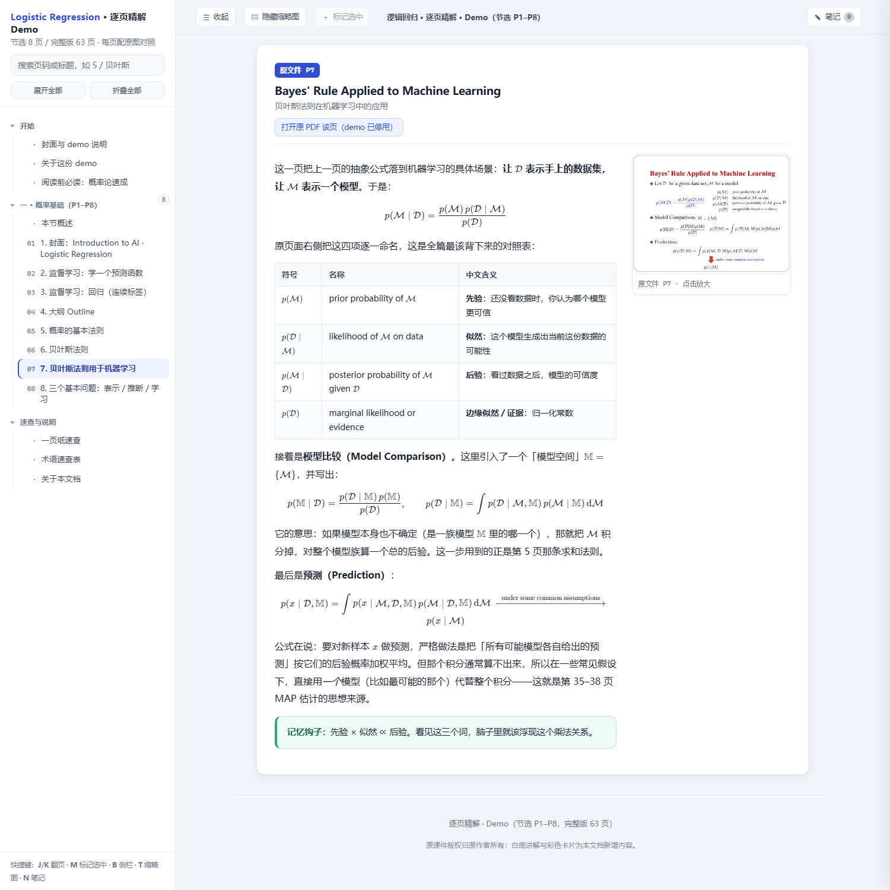
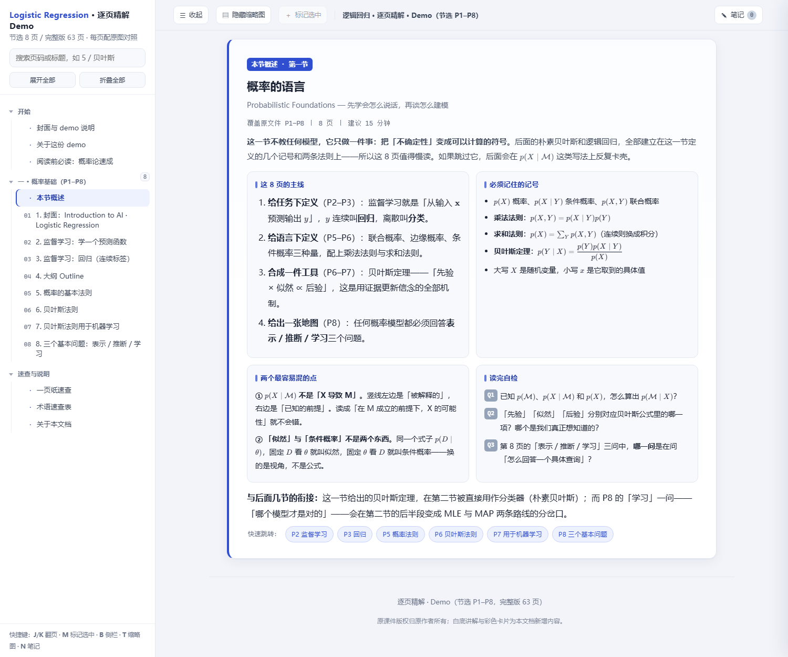
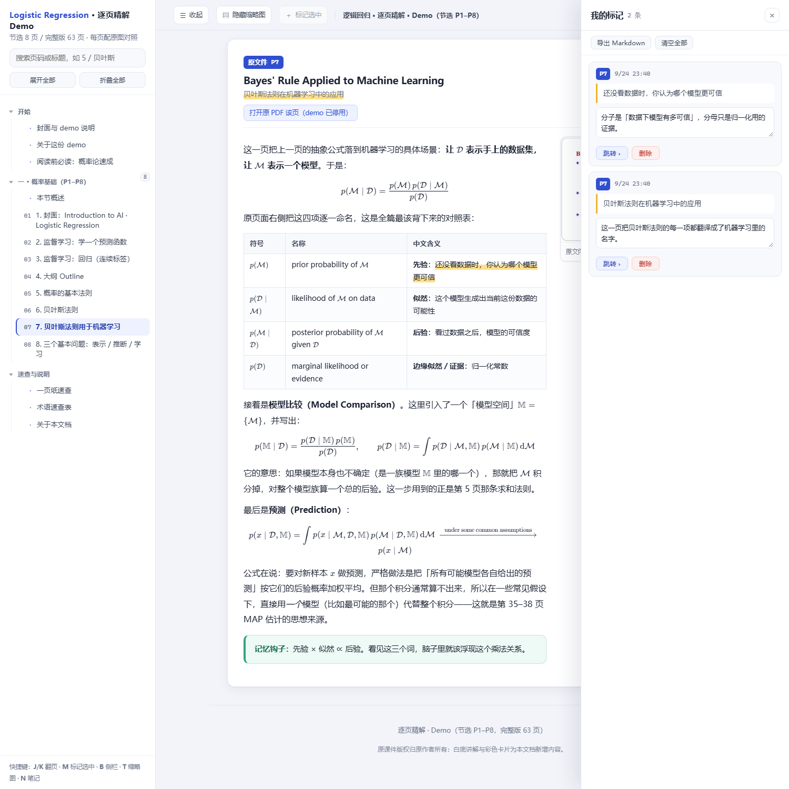

English ｜ [简体中文](README.md)

# pdf-slides-annotated-html

> Turn lecture PDFs into a **single-file HTML** with complete per-page explanations sitting next to the original slides: thumbnail cross-reference, offline formula rendering, collapsible TOC, text highlighting with a notes drawer — fully offline.
> The explanations are **written by an AI agent**: hand it your deck, get a finished document in one conversation. You can also run everything yourself.

**▶ [Try the live demo](https://zzzhen-22.github.io/slides-annotated-html/demo-en/)** — an 8-page interactive excerpt, **fully in English**. Nothing to install: click the TOC, highlight a sentence, take a note. (The original Chinese demo lives [here](https://zzzhen-22.github.io/slides-annotated-html/demo/).)



Feed it a slide deck (a lecture PPT exported to PDF, a tech talk, training material) and it produces a self-contained `.html`:

- Explanations on the **left**, original page thumbnails on the **right** — no window switching
- Formulas rendered by **KaTeX, fully offline** (fonts embedded as data URIs)
- Five interactions: collapsible TOC / per-section overview cards / thumbnails auto-enlarge when the sidebar collapses / **highlight text → notes drawer** / **A− / A＋ to adjust body text size (level saved in your browser)**
- Clearly separates "what the original says" from "what the explainer added" (green = intuition, blue = added derivation, red = source issue, gray = quotation)
- Optionally **embed the original PDF** (base64) so page-deep links survive across devices

<p align="center">
  
  
</p>

> **Where the quality comes from:** text layers of slide-exported PDFs are unreliable — math glyphs are frequently mis-mapped, so trusting them guarantees wrong explanations. The pipeline therefore *forbids* skipping page-by-page image reading, for agents and humans alike. Everything mechanical (skeleton, rendering, assembly, checks, screenshots) is automated; the per-page explanations are written by the agent — your job is a final review, not typing page by page.

---

## Let an AI do it (recommended)

This repository *is* an Agent Skill: `SKILL.md` contains complete, executable instructions for an AI agent — how to clarify requirements, how to read each rendered page and write explanations, how to verify before delivery.

**WorkBuddy**: drop the repo into `~/.workbuddy/skills/pdf-slides-annotated-html/`, then just ask: *"Turn this lecture PDF into an annotated HTML."*
The agent will self-check the environment, draft a section outline from the deck, **confirm the structure with you**, build the skeleton from that outline, **read every rendered page and write the explanations**, re-check until "pending pages = 0", pass all validations and screenshots, then deliver — reporting any page it is unsure about and any problem found in the original deck.

**Other AI coding assistants**: clone the repo and hand `SKILL.md` to your agent as the task brief (Claude Code and similar tools that support the SKILL.md format can install it as a skill directly).

**After delivery, do one thing**: spot-check the paraphrasing of key formulas. The validations catch rendering and structural errors, and the annotation rules make "original" vs. "added" visually distinct — but whether a formula explanation is *semantically* correct can only be confirmed by a human eye. If a page reads wrong, point at it and let the agent rewrite.

---

## Run it yourself

The same suite in manual mode — you write the explanations instead of the agent.

### Quick start

In the repository root:

```bash
pip install -r requirements.txt                        # ① Python deps (pymupdf, pillow)
python scripts/kitpath.py                              # ② environment self-check: python / node / browser / deps
python scripts/run_all.py examples/sample-lecture.pdf --out demo   # ③ one-shot run (8-page sample deck)
```

- Step ② prints a four-item check; anything missing comes with a copy-paste fix.
- Step ③ needs Chrome / Edge for headless checks and screenshots (auto-detected, or set `KIT_BROWSER`). Node is optional — only `check_math.js` uses it, and the step is skipped if absent.

| Dependency | Used for | Notes |
|---|---|---|
| Python 3.9+ | all scripts | see `requirements.txt`; missing packages produce a copy-paste pip command |
| Chrome / Edge | headless checks & screenshots | auto-detect: env var → PATH → common install locations |
| Node.js (optional) | `check_math.js` formula check | the only place node is used; skipped if absent |

You get: `config.json`, `content/` skeletons with TODO markers, `_extract/` page images + thumbnails, `_katex/` offline KaTeX (bundled, no download), the single-file HTML plus a per-project `README`. Step ⑦ reports **pending pages N / M — target 0**.

Re-check after editing `content/` (skips skeleton & rendering, much faster):

```bash
python scripts/run_all.py "<deck>.pdf" --out "<same dir>" --skip-init --skip-prepare
```

Prefer step by step? `prepare_pdf.py` (page images + text layer) → read `_extract/page-NN.png` and write `content/*.html` → `build.py` → `check_math.js` / `check_ui.py` / `probe.py` / `shot.py`. The full walkthrough for humans lives in **[docs/workflow.md](docs/workflow.md)**.

---

## Known limitations

- Input is **PDF only**; export PPTX/Keynote to PDF yourself first — no LibreOffice dependency, by design.
- PDF text layers are unreliable: explanations are written from **rendered page images**, never the raw text layer. The suite does not judge whether your source is correct — source errors are flagged, not silently fixed.
- The mechanical part is automated; the explanations themselves are written by the agent (or by you). The suite just tells you how many pages are still pending.
- With the original PDF embedded, output size ≈ PDF size × 1.34 + thumbnails; a large deck can reach 20 MB+.
- Output typography is optimized for **Chinese** (font stack, punctuation squeezing). Other languages work but are not specially tuned.
- Headless screenshots require a Chromium-based browser.

---

## Verification, briefly

Every deliverable must pass all of these — mechanical checks catch what screenshots cannot:

| Check | Catches |
|---|---|
| `check_math.js` | formulas that cannot render, CJK inside math, broken anchors, missing glyphs (hard fail), leftover TODOs |
| `check_ui.py` | the five interactions' wiring — DOM / CSS / JS alignment (including the `--fs` scale variable, the `max-width` compensation, and the font-size localStorage key) |
| `probe.py` + `probe_marks.js` | structural damage invisible in screenshots (e.g. block elements inside `<mark>`), via real-UI selection & assertion |
| `probe.py` + `probe_font.js` | **body text size control**: 100% on load, `--fs` / label / localStorage staying in sync after `step()`, restore via `Font.init()`, MIN(0.9)/MAX(1.4) clamping and button disabling; run twice with `--profile` to prove cross-session persistence |
| `probe.py` + `probe_doc.js` | **is the content actually finished**: pending pages N / M, pages missing a thumbnail, broken TOC anchors, leftover KaTeX `<script>` tags, TODO comments, missing-glyph risk | whether the explanations are *correct* |
| `shot.py` | looks and real interaction states |

> The six rows above check the **output**. One more script checks the **suite itself**: `check_docs.py`
> asserts that cross-document facts ("how many interactions?", which scripts a step runs, the
> pitfalls numbering) stay in sync across the five docs and the code. It is what catches
> "changed the feature, forgot the docs". It is not part of `run_all.py` (that pipeline runs a
> user's deck); `selftest.py` runs it as part of its pass.

Self-test: `python scripts/selftest.py` — builds a synthetic 6-page PDF and exercises both routes (mechanical pipeline + semantic outline path), then checks the suite's own doc/code consistency; expect the final line `自检结果: PASS`.
To check only the docs (fast — run this after editing README / SKILL.md or adding an interaction): `python scripts/check_docs.py`.

These run automatically in CI: `.github/workflows/selftest.yml` runs the full `selftest.py` (all three checks) on every push to `main` and every PR, on both Ubuntu and Windows runners.

---

## License & third-party

**GNU General Public License v3.0** — full text in [LICENSE](LICENSE). Copyright (C) 2026 zzzhen-22.
In short: free to use, modify and redistribute, but any modified version you release must also be GPL-3.0 open source.

- [KaTeX](https://katex.org/) — MIT License. The offline build under `vendor/katex/` embeds fonts as data URIs. MIT is one-way compatible with GPLv3, so it ships with this project.
- [PyMuPDF](https://pymupdf.readthedocs.io/) — AGPL-3.0 / commercial dual license. This project only calls it as a pip dependency and ships none of its code, so the project itself is GPL-3.0. However, **if you distribute the combined work (this project + PyMuPDF), the combination is subject to AGPL**. To avoid that, swap in pypdf or similar (requires rewriting `prepare_pdf.py`).

More: [SKILL.md](SKILL.md) (agent instructions) · [docs/workflow.md](docs/workflow.md) (human-oriented walkthrough) · [TODO.md](TODO.md) (roadmap)
