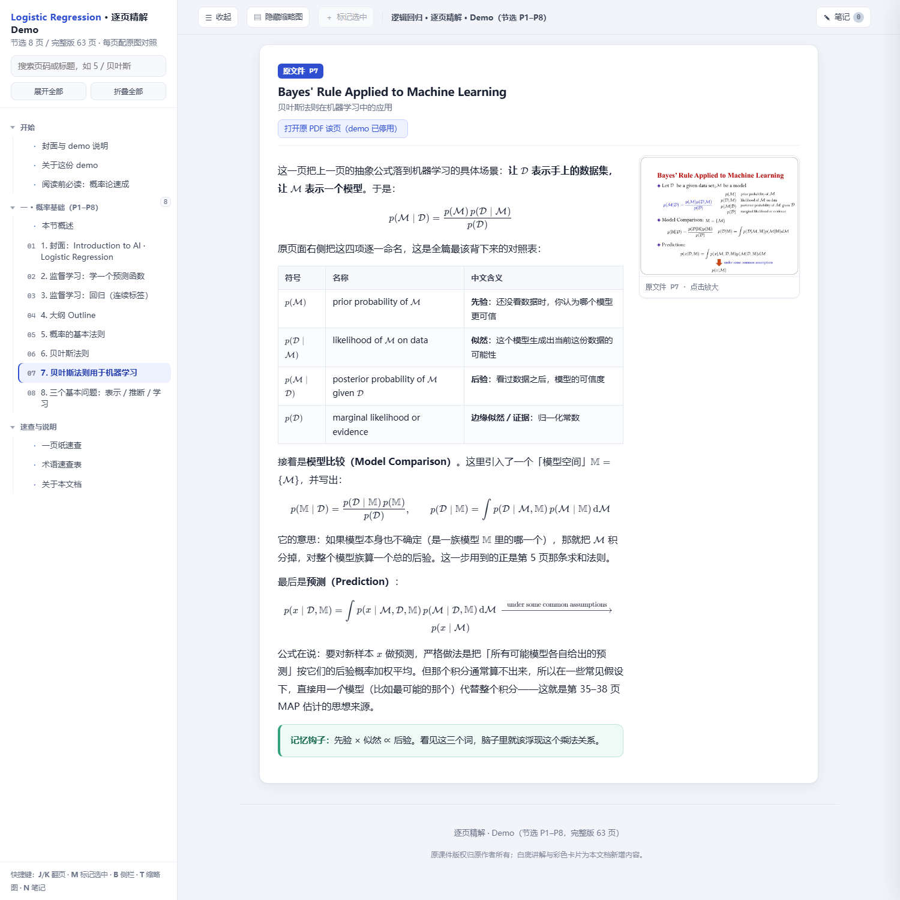
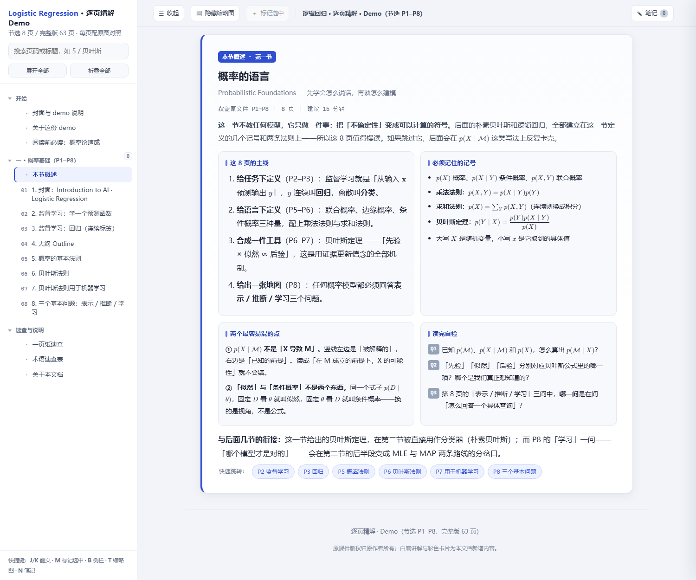
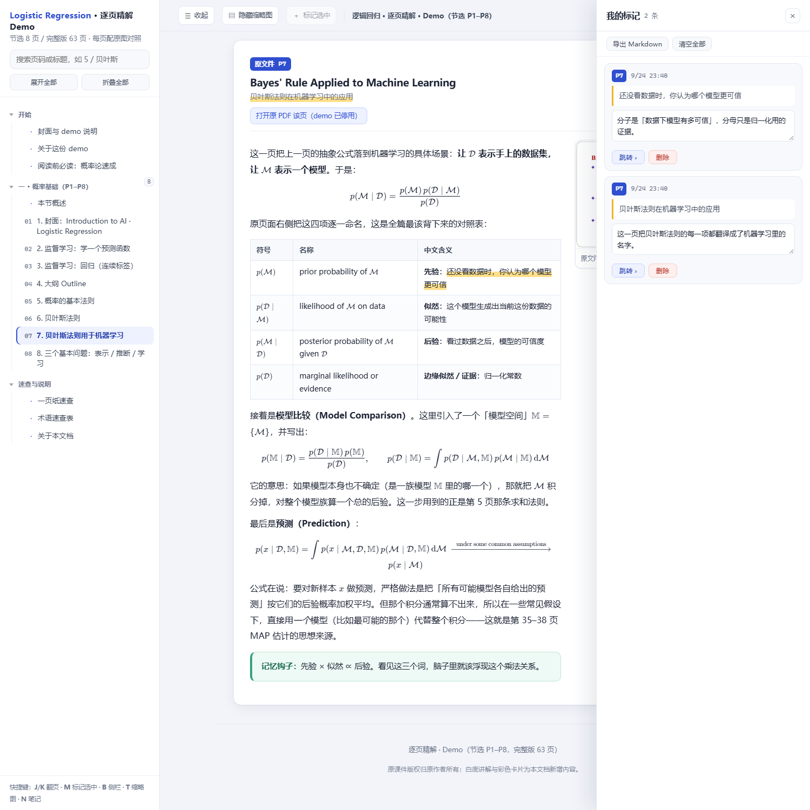

[English](README.en.md) ｜ 简体中文

# pdf-slides-annotated-html

> 把 PDF / PPT 课件变成**内容完整**的「左看讲解、右对原文」单文件 HTML：
> 逐页缩略图对照、公式离线渲染、目录折叠、划词标记＋笔记抽屉，断网可开。
> 逐页讲解由 **AI agent 替你写**——丢给它一份课件，一轮对话拿成品；也可以自己动手跑。

**▶ [点这里在线试一下](https://zzzhen-22.github.io/slides-annotated-html/demo/)** —— 节选 8 页的 demo，**不需要安装任何东西**，直接在浏览器里点目录、划句子、写笔记。



输入一份几十页的讲稿型课件（大学课程 PPT 导出 PDF、技术分享、培训材料），输出一个自包含的 `.html`：

- **左侧**是逐页中文讲解，**右侧**贴着原页缩略图，不用来回切窗口
- 公式用 **KaTeX 离线渲染**（字体已转 data URI 内嵌，**完全不联网**）
- 四类交互：目录逐级折叠 / 每节概述卡 / 侧栏收起后缩略图自动放大 / **划词标记 → 笔记抽屉**
- 页面里明确区分「原文有什么」与「讲解者加了什么」（绿=直觉、蓝=补充推导、红=原稿问题、灰=原文引用）
- 可选把**原 PDF 整份 base64 内嵌**，点页码直接跳原页，换设备也不失效

<p align="center">
  
  
</p>
<p align="center">
  <sub>左：每节一张「本节概述」卡，读完回到这里自测　·　右：划词标记进笔记抽屉，可写备注、跳回原文、导出 Markdown</sub>
</p>

> **讲解质量从哪来？** PPT 导出的 PDF 文字层不可靠——数学符号的字体映射常常是坏的，
> 只读文字层必然讲错公式。所以这套流程**不许任何人（包括 agent）跳过逐页看图**：
> 每一页讲解都对应一张真的被「看」过的渲染图。机械部分（建骨架、渲染、组装、体检、截图）
> 全自动，逐页看图写讲解由 agent 承担——你负责的是最后审一眼，而不是逐页码字。

---

## 让 AI 替你做（推荐）

这个仓库本身就是一份可直接安装的 **Agent Skill**：`SKILL.md` 是写给 AI agent 的完整执行指令
（怎么问清需求、怎么逐页看图写讲解、怎么验证交付），装好后你只需要一句话。

### WorkBuddy 用户

1. 把本仓库放到 `~/.workbuddy/skills/pdf-slides-annotated-html/`
2. 对话里直接说：**「把这份课件 PDF 做成逐页对照讲解」**，附上文件即可

Agent 会自动完成：环境自查 → 一键流水线 → **逐页看图写讲解** → 复检至「待补页面 = 0」
→ 三重校验 + 截图 → 交付，并显式报告它拿不准的页面与原稿本身的问题。

### 其他 AI 编程助手

把仓库 clone 到本地，将 `SKILL.md` 作为任务说明书交给 agent（Claude Code 等支持
SKILL.md 技能格式的工具也可以直接按技能安装）。流程与验收标准都在里面，agent 照做即可。

### 交付后建议你做的一件事

**抽查关键公式的转述。** 套件的设计让错误无处藏身——三重校验拦住渲染与结构问题，
显式标注规则让「agent 补充的」和「原文的」一眼可分——但「对公式的语义理解是否正确」
机器自检管不了，最后这一道关是你的眼睛。发现讲错的页，直接指着页面让 agent 重写。

---

## 自己动手跑（手工路径）

不经过 agent、只想用机械部分自己写讲解？完全支持，这是同一套件的手工模式。

### 三步上手

在仓库根目录执行：

```bash
pip install -r requirements.txt                        # ① 安装 Python 依赖（pymupdf、pillow）
python scripts/kitpath.py                              # ② 自查：python / node / 浏览器 / 依赖
python scripts/run_all.py examples/sample-lecture.pdf --out demo   # ③ 一键跑通（8 页示例课件）
```

- ② 打印四项检查，任何一项不是 ✔ 都会给出可直接照抄的解决办法；
- ③ 的无头体检与截图需要 Chrome / Edge（自动探测，也可用环境变量 `KIT_BROWSER` 指定）；
  `node` 只用于公式语法自检，缺了会自动跳过这一步。

### 环境

| 依赖 | 用途 | 说明 |
|---|---|---|
| Python 3.9+ | 全部脚本 | 依赖清单见 `requirements.txt`；缺包时脚本会给出可直接照抄的 pip 命令 |
| Chrome / Edge | 无头截图与 DOM 断言 | 自动探测：环境变量 → PATH → 常见安装位置 |
| Node.js（可选） | `check_math.js` 公式自检 | 唯一用到 node 的地方；缺了时该步自动跳过 |

### 跑完 ③ 你会得到

- `config.json` — 组装配置（目录结构、标题、内嵌开关）
- `content/` — 逐页讲解骨架，**带 TODO 标记**，等人（或 agent）来写讲解
- `_extract/` — `page-NN.png`（逐页核对用）＋ `thumb_NN.jpg`（内嵌用）
- `_katex/` — 离线 KaTeX（已内置，无需下载）
- 单文件 HTML ＋ `README-项目.md`
- **⑦ 会报 `内容进度：待补页面 N / M`，目标是 0**

改完 `content/` 后复检（跳过建骨架与渲染，快得多）：

```bash
python scripts/run_all.py "<课件.pdf>" --out "<同一目录>" --skip-init --skip-prepare
```

### 分步执行

```bash
python scripts/prepare_pdf.py "<课件.pdf>" "_extract" 860 75   # 逐页图 + 缩略图 + 文字层
#   ↓ 逐页看 _extract/page-NN.png，写 content/*.html
python scripts/build.py config.json                             # 组装单文件
node   scripts/check_math.js "<输出.html>" "_katex/katex.min.js" # 公式语法 + 标签/锚点/数量
python scripts/check_ui.py   "<输出.html>"                      # 四类交互的「接线」是否完好
python scripts/probe.py      "<输出.html>" scripts/probe_marks.js
python scripts/probe.py      "<输出.html>" templates/probe_doc.js
python scripts/shot.py       "<输出.html>" "_extract/v_home.png" # 截图看长相
```

> 想理解每一步在做什么、为什么不能省，见 **[docs/workflow.md](docs/workflow.md)**
> （人类向的完整流程讲解，不要求你读 SKILL.md）。

---

## 目录结构

```
├─ SKILL.md                 ← 给 AI agent 的执行指令：完整工作流 + 铁律 + 改套件的纪律
├─ scripts/
│   ├─ run_all.py           ← 主入口：一键流水线（①–⑧）
│   ├─ kitpath.py           ← 路径自查：python / node / 浏览器 / Python 依赖
│   ├─ init_project.py      ← 只建骨架（--group-by 控制分段策略）
│   ├─ prepare_pdf.py       ← PDF → 逐页 png + 缩略图 + 文字层
│   ├─ katex_offline.py     ← 制作离线 KaTeX（一次即可，可跨项目复用）
│   ├─ build.py             ← 组装单文件（可用 0 命令行参数：python build.py config.json）
│   ├─ check_math.js        ← 公式语法、标签配对、目录锚点、正文缺字体检
│   ├─ check_ui.py          ← 四类交互的 DOM 与 CSS/JS 是否对齐
│   ├─ probe.py             ← 无头跑探针 JS 并把结果读回来（读 DOM 靠它）
│   ├─ probe_marks.js       ← 标记功能回归（跨格/跨段/跨公式/单段 + 重开恢复）
│   ├─ glyph_probe.py       ← 正文符号探针：把非中文符号排成一页，肉眼查方框
│   └─ shot.py              ← 无头截图（--script 可先触发交互再截）
├─ assets/                  ← 已验证的外壳与样式，build.py 自动内联
│   ├─ shell.html           ← 页面骨架（改版式改这里，不要改 build.py）
│   ├─ site.css             ← 基础版式
│   ├─ site.extra.css       ← 四类交互的追加样式
│   └─ site.js              ← 全部交互逻辑，暴露 window.__doc 供无头测试
├─ templates/               ← 可复制的内容骨架 + 交付体检 + 截图 harness
├─ examples/                ← sample-lecture.pdf 示例课件（三步上手 ③ 的输入）、config 样例、逐页区块模板
├─ references/
│   ├─ pitfalls.md          ← 踩坑清单（36 条，按「频率 × 隐蔽度」排序）
│   └─ content-quality.md   ← 讲解内容的质量标准
├─ vendor/katex/            ← 离线 KaTeX（MIT，见下方致谢）
├─ docs/
│   ├─ workflow.md          ← 人类向完整流程：每步做什么、为什么不能省
│   ├─ demo/                ← 在线 demo：节选 8 页的可交互产物（单文件）
│   └─ images/              ← README 里那几张截图
└─ TODO.md                  ← 路线图：让它对陌生人更好用的待办清单
```

**整个目录可以任意搬迁**：所有脚本都用相对自身位置定位资源，不含任何写死的用户名或安装路径。
「外部程序在哪」一律问 `scripts/kitpath.py`。

---

## 三重校验各管一段，都要过

| 脚本 | 管什么 | 不管什么 |
|---|---|---|
| `check_math.js` | 公式能不能渲染、CJK 有没有混进公式、标签配对、目录锚点、缩略图/区块/深链数量、正文缺字（组合符号 U+20D0–U+20FF，硬失败）、TODO 残留 | 长相、交互 |
| `check_ui.py` | 四类交互的 DOM 与 CSS/JS 是否对齐（分组数与按钮数相等、收起后列宽真的变大、抽屉元素齐全、`DOC_NS` 已注入、标记上色的结构安全） | 长相、实际行为 |
| `probe.py` + `probe_marks.js` | **结构有没有被改坏**：自动找跨格/跨段/跨公式/单段四种选区，用**真实入口**标记后断言「块级元素数、可见文本、表格 tr/td 一字不变、无块级元素进 mark、无零宽 mark」，再拆掉全部 mark 重新定位一遍复查 | 长相 |
| `shot.py` | 长相与真实交互状态 | 细节正确性 |

**截图看不出结构被改坏**，所以只要动了标记相关代码，`probe.py` 这一行不能省。

### 自检

```bash
python scripts/selftest.py        # 现造一份 6 页小 PDF，把整条流水线从零跑一遍，期望结尾「自检结果: PASS」
```

---

## 已知限制

- 输入**只支持 PDF**；PPTX/Keynote 请先自行导出（不引入 LibreOffice 依赖是刻意的）
- **PDF 文字层不可靠**：讲解一律从逐页渲染图写出，不读抽象文字层；套件不替你判断内容对错——原稿有错会如实标注，不会静默修正
- 机械部分自动，**逐页看图写讲解由 agent（或你）完成**，套件只告诉你还差几页没写
- 内嵌原 PDF 时产物 ≈ 原 PDF × 1.34 + 缩略图，几十页课件可能到 20 MB+
- 默认产物是**中文排版优化**的（正文字体栈、标点挤压），其他语言内容也能用但排版不专门优化
- 无头截图依赖 Chromium 系浏览器

---

## 交付纪律（对人和 agent 同样有效）

以下五条是产物质量的来源，无论执行者是你还是 AI agent，一条都不能让：

1. **不许跳过逐页看图。** 抽象文字层的课件一律先渲染再读，否则必然讲错公式。
2. **不许在没有验证的情况下交付。** 公式批量自检 ＋ 至少 3 张截图，缺一不可。
3. **忠于原文件顺序。** 页码、标题、公式位置不得擅自调整；要补充的内容单独成篇并标明。
4. **新增内容必须显式标注。** 读者要能一眼分清「原文有什么」和「讲解者加了什么」。
5. **原生问题如实标注并给处理说明**，不要静默修正。

---

## 改这个套件时的纪律

- **先看 mtime**，不要凭记忆假定文件内容——`assets/` 与 `scripts/` 可能刚被别的会话改过。
- **改完必须「重建 ＋ 三校验 ＋ 截图」四连**，并把新产物与旧产物 diff；目录块应当逐字节一致。
- **资产是耦合的**：改 `shell.html` 的类名就要同步改 `site.extra.css` 与 `site.js`，只改一处页面要么裸奔要么交互失效。
- **不许写死本机路径**。校验：`grep -rn "/home/\|/Users/\|C:/Users/" scripts/ assets/ templates/` 应当无命中。
- **模板注释里不许出现字面标签**。`build.py` 用非贪婪正则匹配整段区块，注释里的假 `<section>` 会让它提前收尾，症状是「图在文件里、但 DOM 里查不到」，极难排查。

动笔前先扫一遍 `references/pitfalls.md`（36 条，每条都对应一个真实事故）。

---

## 关于运行环境

套件本身是**独立的 Python + Node 脚本**，不依赖任何特定 Agent 平台，命令行即可跑通；
上面的 Agent Skill 只是它的一种使用方式。分工是：`SKILL.md` 说给 agent 听（执行指令），
`docs/workflow.md` 与本 README 说给人听（原理与操作），`references/` 是两边共用的规范与踩坑记录。

---

## 致谢 / 第三方

- [KaTeX](https://katex.org/) — 数学公式排版引擎，**MIT License**。
  `vendor/katex/` 下是构建好的离线版本（CSS 里的字体已转 data URI），版权归 KaTeX 作者所有。
  MIT 与 GPLv3 是**单向兼容**的（MIT 代码可以并入 GPLv3 作品），因此可以随本项目一起分发，
  只需保留其原始版权声明。
- [PyMuPDF](https://pymupdf.readthedocs.io/) — PDF 渲染与文字层抽取，**AGPL-3.0 / 商业双授权**。
  本项目**只把它当作运行时 pip 依赖调用，不复制、不分发它的任何代码**，所以本项目自身
  可以按 GPL-3.0 发布。但请注意一个真实的约束：**如果你要分发「本项目 ＋ PyMuPDF」的组合成品，
  仍需同时满足 PyMuPDF 的 AGPL 条款**（AGPLv3 与 GPLv3 可以组合，组合后的整体按 AGPL 约束）。
  只想避开这条，把 PyMuPDF 换成 pypdf 之类的宽松许可库即可（需自行改写 `prepare_pdf.py`）。

## License

**GNU General Public License v3.0** — 全文见 [LICENSE](LICENSE)。

Copyright (C) 2026 zzzhen-22

一句话说清它意味着什么：你可以自由使用、修改、再分发本项目，**但一旦发布了修改后的版本，
就必须同样以 GPL-3.0 开源**。选它的理由正是这个——希望基于它做出来的东西能回到社区，
而不是被闭源吃掉。
